#### Deployment

- The project is deployed on Vercel and can be accessed here: [Scoll Web dApp](https://scroll-dapp-smoky.vercel.app/)

#### To run the project

1. Clone the repository
2. Run `npm install` to install the dependencies
3. Run `npm run dev` to start the development server
4. Open [http://localhost:3000](http://localhost:3000) in your browser to see the application

### Technical Details

```
📦 src
└─ app
   └─ components      // Reusable components
      └─ ui           // generated using `shadcn/ui`
   ├─ history         // api route for /transaction history
   ├─ lib             // utility functions
   ├─ providers       // Context providers - WalletProvider
   ├─ types           // Typescript types
   └─ page.tsx        // Landing page
```

- TypeScript: For type-safe JavaScript development.
- React: For building the user interface.
- Tailwind CSS: For styling the components.
- Ethers.js: For interacting with the Ethereum blockchain.
- Next.js: For server-side rendering and API routes.
- Vercel: For deployment.

#### Features

- Landing page
  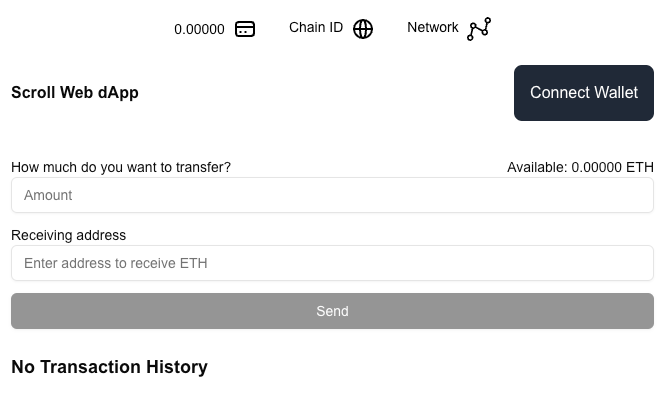

#### Wallet Connection:

- Allow users to connect their wallet using MetaMask.
- Show the connected wallet’s address (Click on 'Connect Wallet' button)
- Allows the user to disconnect (Click on the wallet address button to disconnect the wallet)

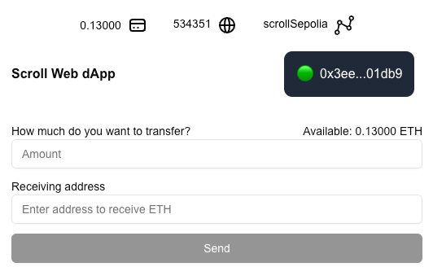

#### ETH Balance Display:

- Fetch and display the connected user's ETH balance on Scroll Layer2. (When wallet connected, UI will retrieve wallet
  balance, chainId and network name from Ethers.js)

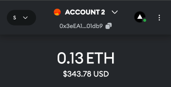
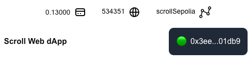

#### Transfer Form:

- Validate input fields and handle errors (e.g., insufficient balance, invalid address). ('Send' button will be disabled
  if the input fields are empty or invalid, or if wallet is not connected)
  


- Allow the user to input a recipient’s address and the amount of ETH to transfer.
  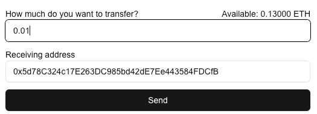


- When user clicks on the 'Send' button, the button will be disabled and display a spinner to indicate that it's
  processing the transaction.
  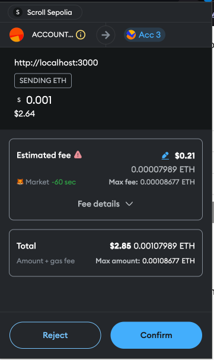
  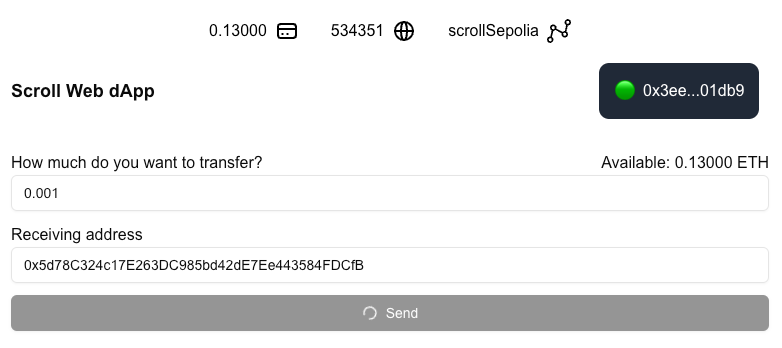


- On successful transfer, display a confirmation dialog. User is able to check their transaction on block explorer with
  the given hash. E.g. of the confirmed transaction:
  `0x4ba2da8a88d8af1fa6a0a9fcbc60dfb70ea8cf78f3bdcf5c1c64ab1971e27cc1`
  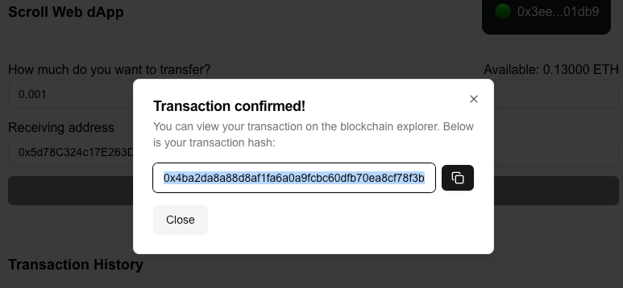

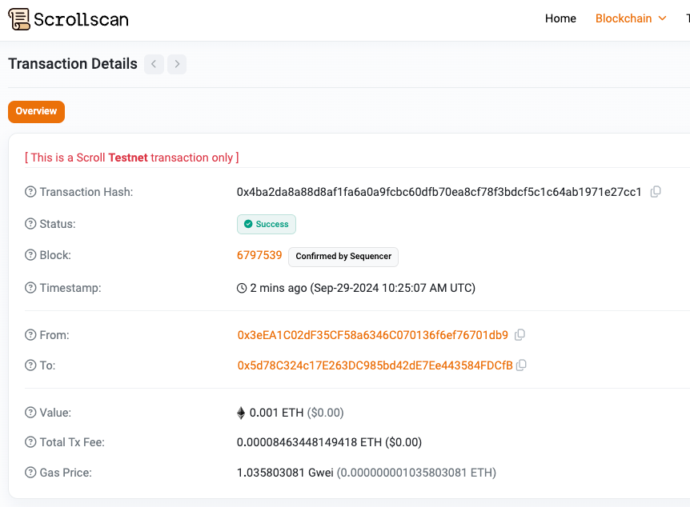
https://sepolia.scrollscan.com/tx/0x4ba2da8a88d8af1fa6a0a9fcbc60dfb70ea8cf78f3bdcf5c1c64ab1971e27cc1

#### Transaction History:

- Store the transfer details (recipient address, amount, timestamp) in a mock backend using Next.js API routes.
- Display the transaction history on the front-end in a list format. (Please refresh the page to see the latest
  transaction)
  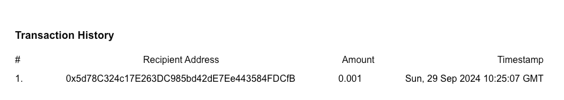

#### Responsive Design:

- Add additional UI/UX enhancements such as loading spinners during wallet connection or transaction submission.
  Transaction submission spinner:
  

- Mobile-responsive design.
  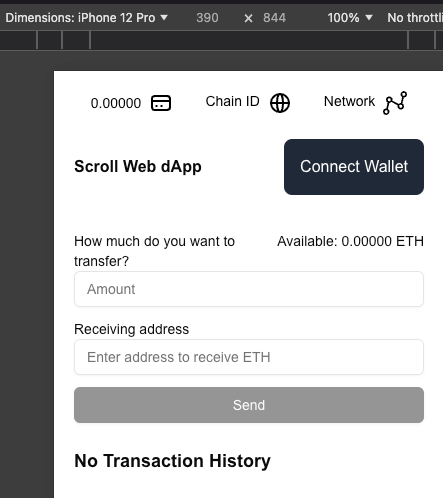

### Design decisions

1. Used `shadcn/ui` for customizing the UI components to have full design control and flexibility, especially if
   following an internal Design System.
2. Used `Ethers.js` for interacting with the Ethereum blockchain. It is a popular library for interacting with Ethereum
   wallets and smart contracts.
3. Used `Next.js` for server-side rendering and API routes.
4. To view the latest transaction, please refresh the page.

### Future Improvements

1. Use a real backend to store the transaction history.
2. Use `wagmi` to interact with Metamask wallet and handle transactions.
3. E2E testing using Cypress.

### Side note

- For each pull request, I have added vercel preview for each PR. You can check the PRs for the preview link. This is to
  ensure that the code is working as expected before merging it to the main branch.
- Please merge the PR on the `develop` branch to the `main` branch to deploy the latest changes.