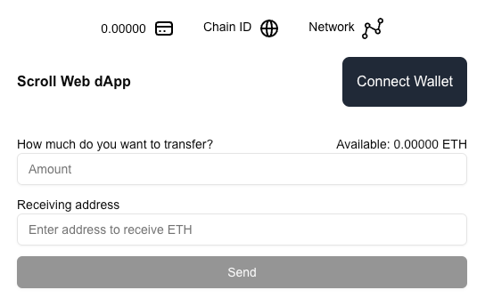
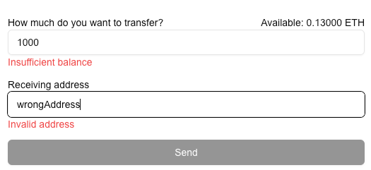

####                     

#### To run the project

1. Clone the repository
2. Run `npm install` to install the dependencies
3. Run `npm run dev` to start the development server
4. Open [http://localhost:3000](http://localhost:3000) in your browser to see the application

#### Features

- Landing page
  

#### Wallet Connection:

- Allow users to connect their wallet using MetaMask.
- Show the connected wallet’s address (Click on 'Connect Wallet' button)
- Allows the user to disconnect (Click on the wallet address button to disconnect the wallet)

#### ETH Balance Display:

- Fetch and display the connected user's ETH balance on Scroll Layer2. (When wallet connected, UI will retrieve wallet
  balance, chainId and network name from Ethers.js)

#### Transfer Form:

- Validate input fields and handle errors (e.g., insufficient balance, invalid address). ('Send' button will be disabled
  if the input fields are empty or invalid, or if wallet is not connected)
  

- Allow the user to input a recipient’s address and the amount of ETH to transfer.
  

- When user clicks on the 'Send' button, the button will be disabled and display a spinner to indicate that it's
  processing the transaction.
  
  

- On successful transfer, display a confirmation dialog. User is able to check their transaction on block explorer with
  the given hash. E.g. of the confirmed transaction:
  `0x4ba2da8a88d8af1fa6a0a9fcbc60dfb70ea8cf78f3bdcf5c1c64ab1971e27cc1`
  

https://sepolia.scrollscan.com/tx/0x4ba2da8a88d8af1fa6a0a9fcbc60dfb70ea8cf78f3bdcf5c1c64ab1971e27cc1

#### Transaction History:

- Store the transfer details (recipient address, amount, timestamp) in a mock backend using Next.js API routes.
- Display the transaction history on the front-end in a list format. (Please refresh the page to see the latest
  transaction)
  

#### Responsive Design:

- Add additional UI/UX enhancements such as loading spinners during wallet connection or transaction submission.
  Transaction submission spinner:
  

- Implement a mobile-responsive design.
  

### Future Improvements

1. Use a real backend to store the transaction history.
2. Use `wagmi` to interact with Metamask wallet and handle transactions.
    - Edge cases: UI will not reflect changes during account switch.
    - 